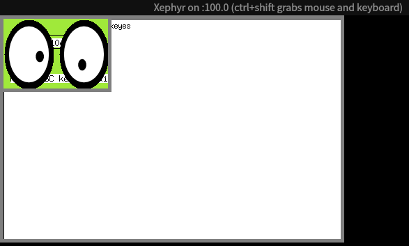

# tinywm

#### 介绍

使用xcb写的X11简易窗口管理器。

目前完成度80%左右，键盘那块我没弄了，没找到xcb到底提供哪些关于键盘和鼠标的API和掩码和码值映射。

目前代码是同步的，如果要改成异步的，应该是将所有 `errorHandler()` 部分改成不带 `_checked()` 后缀的API，然后在事件循环中添加 `errorHandler()` 的逻辑。

#### 安装依赖

```shell
sudo apt install build-essential libx11-dev libgoogle-glog-dev xserver-xephyr xinit x11-apps xterm
sudo apt install libxcb1-dev libxcb-keysyms1-dev libxcb-util0-dev libxcb-icccm4-dev
```

#### 运行

```shell
./run.sh
```


##### 关于键盘操作

> 存在小键盘的键盘，在开启NumLock时，按下的键会带上一个NumLock

我使用的是带小键盘的电脑，使用时需要先关闭所有的键盘修饰键（如 <kbd>NumLock</kbd>、<kbd>CapsLock</kbd> ）。

可以使用 `xmodmap` 命令查看key modifier 掩码：

```shell
xmodmap:  up to 4 keys per modifier, (keycodes in parentheses):

shift       Shift_L (0x32),  Shift_R (0x3e)
lock        Caps_Lock (0x42)
control     Control_L (0x25),  Control_R (0x69)
mod1        Alt_L (0x40),  Alt_R (0x6c),  Meta_L (0xcd)
mod2        Num_Lock (0x4d)
mod3      
mod4        Super_L (0x85),  Super_R (0x86),  Super_L (0xce),  Hyper_L (0xcf)
mod5        ISO_Level3_Shift (0x5c),  Mode_switch (0xcb)
```

Supported keyboard shortcuts:

* **Alt + Left Click**: Move window
* **Alt + Right Click**: Resize window
* **Alt + F4**: Close window
* **Alt + Tab**: Switch window

#### 可供参考的材料

以下是我在网上找到的wm项目，不过我没看，因为我是写完了才找到的😥..

- [tinywm (incise.org)](http://incise.org/tinywm.html)
- [Meha555/basic_wm: 简易X11窗口管理器实现 (github.com)](https://github.com/Meha555/basic_wm)

#### TODO

- [x] 添加标题栏
- [ ] 最小化最大化关闭按钮
- [x] X 协议命令原语
